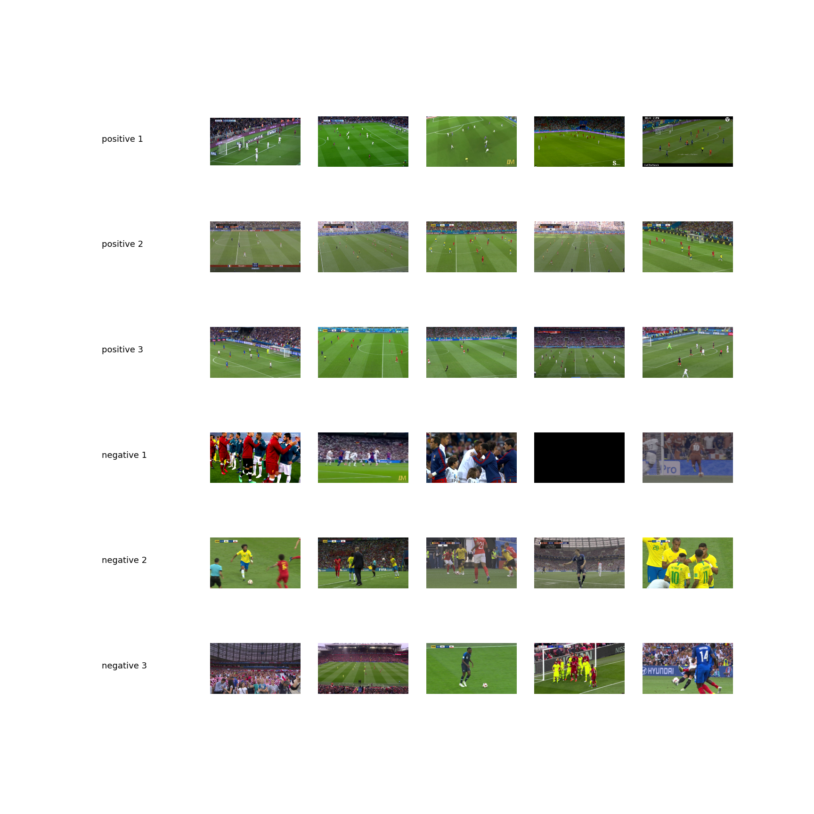

<h1 align="center">FootVid F.C.</h1>
<h2 align="center">Football Video Frames Classification</h2>

    
    

The establishment of **FootVid F.C.** was guided by the simple idea:

<!-- prettier-ignore -->
> Revolutionize the classification of match video frames using AI

In this repository you will find implementation of ML-based methods targeting
the aforementioned task. Sample data available for the project are visualized
below using the source package function:
[`footvid.utils.images.plot_directories_representation`](https://github.com/mrtovsky/footvid/blob/master/footvid/utils/images.py#L32).

    

## Project Organisation

    ├── README.md          <- The top-level README for developers using this project.
    │
    ├── data
    │   ├── interim        <- Intermediate data that has been transformed.
    │   ├── processed      <- The final, canonical data sets for modeling.
    │   └── raw            <- The original, immutable data dump.
    │
    ├── docs
    │   └── images         <- Folder for storing images used across the package documentation.
    │
    ├── models             <- Trained and serialized models, model predictions, or model summaries.
    │
    ├── notebooks          <- Jupyter notebooks. Naming convention is a number (for ordering) and
    │                         a short `-` delimited description, e.g. `0.0-initial-data-exploration`.
    │
    ├── poetry.lock        <- File to resolve and install all dependencies listed in the
    │                         pyproject.toml file.
    ├── pyproject.toml     <- File orchestrating the project and its dependencies.
    │
    ├── footvid            <- Source code for use in this project.

## Related Publications

<!-- prettier-ignore -->
Karpathy et al., [Large-scale Video Classification with Convolutional Neural Networks](https://static.googleusercontent.com/media/research.google.com/en//pubs/archive/42455.pdf)

**Key takeaways:**

- CNNs' expected behavior is to learn increasingly complex patterns with
  successive, deeper layers - first layers will learn more generic features, on
  the contrary, deeper layers will be responsible for learning intricate,
  dataset-specific features. In the case of transfer learning, this will have a
  significant impact on the choice of "defrosted" layers to be fine-tuned.

- Most sport videos are biased towards displaying the objects of interest in
  the central region. Thus, images preprocessing proposed in this article
  includes:

  - cropping to center region,
  - resizing images to 200 × 200 pixels,
  - randomly sampling a 170 × 170 region,
  - randomly flipping the images horizontally with 50% probability.

  The final absolute size of the images is too small for our problem because
  the pre-trained
  [torchvision.models](https://pytorch.org/docs/stable/torchvision/models.html)
  require the image height and width of at least 224 x 224 pixels but the idea
  is definitely worth attention, after appropriate adjustment to the problem
  under consideration.

<!-- prettier-ignore -->
Simeon Jackman, [Football Shot Detection using Convolutional Neural Networks](https://www.diva-portal.org/smash/get/diva2:1323791/FULLTEXT01.pdf)

**Key takeaways:**

- Confirmation of correctness of the appliaction of transfer learning in the
  context of football match TV broadcast analysis, with the use of pre-trained
  models trained on the ImageNet dataset.
